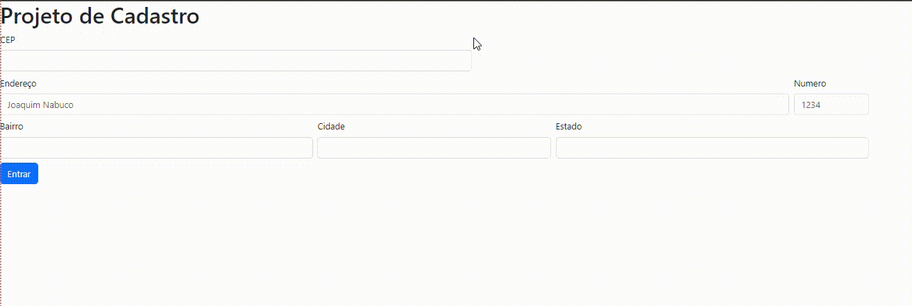

#Indíce

# 💕Projeto - Criando tela de Cadastro com Bootstrap

## ❤️Descrição

Aqui é um novo projeto aonde estou aprendendo a mecher na caracteristica "col" de Bootstrap

## 😘Funcionalidade

- `CEP`  
- `ENDEREÇO`  
- `NÚMERO`  
---  
- `BAIRRO`  
- `CIDADE`  
- `ESTADO`  

### 💖Tecnologias utilizadas

#### VSCODE
- Version: 1.80.2 (system setup)  
- Commit: 2ccd690cbff1569e4a83d7c43d45101f817401dc  
- Date: 2023-07-27T20:40:28.909Z  
- Electron: 22.3.14  
- ElectronBuildId: 22695494  
- Chromium: 108.0.5359.215   
- V8: 10.8.168.25-electron.0  
- OS: Windows_NT x64 10.0.22000  
## 🥰Fontes consultadas